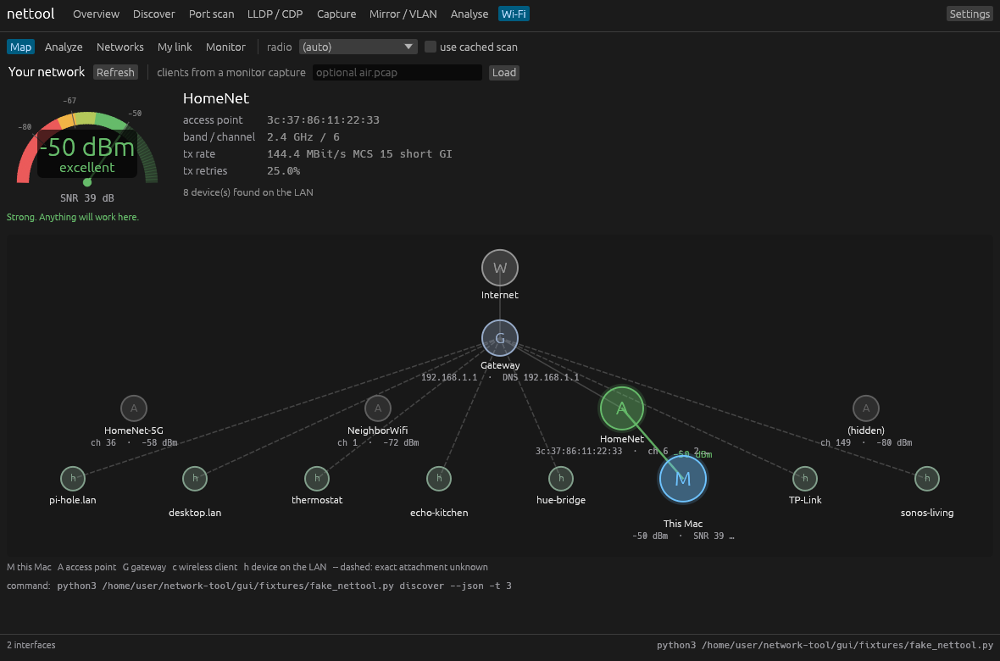

# nettool

A single-file-install, dependency-free network diagnostics CLI for Linux. It answers the
questions you actually have when a network is misbehaving:

* **What is on this LAN?** ARP/ICMP/TCP host discovery with MAC vendor lookup.
* **What is this host running?** Threaded TCP connect scan and UDP probe scan with banner grabbing.
* **Which switch port am I plugged into, and what VLAN is it?** LLDP and CDP neighbour decoding
  (system name, port, native VLAN, PoE budget, management IP, MTU, duplex).
* **What is actually on the wire?** Live packet capture exported as standard `.pcap`
  for Wireshark, with a tcpdump-style filter language.
* **Why is Wi-Fi bad here?** Signal, SNR, retry rates, per-channel airtime survey,
  co-channel and overlapping-channel analysis, and a recommended channel.
* **Is it me or the network?** A single `diag` command that checks link, addressing,
  gateway, DNS, internet reachability, path MTU and Wi-Fi in one pass.

Everything is Python 3.8+ standard library. No pip dependencies, no libpcap, no scapy.
Runs on **Linux and macOS** - the platform-specific layer is isolated, so the protocol
work (pcap, LLDP/CDP, filters, interference scoring) is shared.

There is also a **desktop GUI** in [`gui/`](gui/README.md) (Rust + egui) that drives this
same CLI and renders the results - signal bars, channel congestion charts, live packet
view and switch-neighbour cards.



## Install

```bash
git clone <this repo> && cd network-tool
python3 -m nettool --help          # run straight from the checkout

pip install .                      # or install the `nettool` command
```

On macOS the system Python that ships with the Xcode command line tools is enough
(`xcode-select --install` if you have not run it before).

### Permissions

Raw packet access needs privileges.

**Linux** - run under `sudo`, or grant the capabilities once:

```bash
sudo setcap cap_net_raw,cap_net_admin=eip "$(readlink -f "$(which python3)")"
```

**macOS** - packet access goes through `/dev/bpf*`. Run under `sudo`, or install the
BPF access helper once (the same approach Wireshark uses) and capture as yourself:

```bash
sudo ./gui/macos/install-bpf-access.sh     # then log out and back in
```

| Feature | Needs root / CAP_NET_RAW / BPF access |
|---|---|
| `iface`, `scan`, `pcap` | no |
| `discover` (ARP sweep) | yes — falls back to TCP sweep without it |
| `lldp`, `capture` | yes |
| `ping`, `trace`, `mtu` | usually — unprivileged ICMP sockets work on macOS, and on Linux if `net.ipv4.ping_group_range` allows it |
| `wifi scan/link` | Linux needs `iw`; macOS uses `system_profiler`, and `wdutil` (root) for the BSSID |

### Platform support

| Command | Linux | macOS | How macOS does it |
|---|---|---|---|
| `iface`, routes, ARP, DNS | yes | yes | `ifconfig`, `netstat -rn/-ibn`, `arp -an`, `scutil --dns` |
| `discover` (ARP / ICMP / TCP) | yes | yes | BPF device for the ARP sweep |
| `scan` (TCP/UDP) | yes | yes | plain sockets |
| `capture`, pcap export | yes | yes | `/dev/bpf*` instead of `AF_PACKET` |
| `lldp` / `cdp` | yes | yes | same BPF path |
| `ping`, `trace` | yes | yes | ICMP sockets |
| `mtu` | yes | yes | `IP_DONTFRAG` instead of `IP_MTU_DISCOVER` |
| `wifi scan` / `link` / `analyze` | yes | yes | `system_profiler SPAirPortDataType`, `wdutil info` |
| `wifi survey` (airtime %) | yes | **no** | macOS exposes no `iw survey` equivalent |
| `wifi` retry / failure counters | yes | **no** | not exposed outside the driver |

Two macOS-specific caveats worth knowing:

* **Network names are gated behind Location Services.** Without that permission macOS
  hands `<redacted>` to `wdutil` and `system_profiler` in place of every SSID and
  BSSID. nettool reads your own network's name back from `networksetup
  -getairportnetwork` and the SystemConfiguration store, which are not gated, so
  the link you are on is named either way. Neighbouring names stay blank - shown as
  `(hidden by macOS)`, to distinguish them from an AP that really is hiding its
  SSID - until nettool is granted Location Services.

  macOS only lists an app under Location Services once that app has *asked*, so
  there is nothing to tick until something triggers the prompt - **and only
  nettool.app can trigger it.** CoreLocation ignores a request from a process
  whose own bundle does not declare why it wants location, and a command like
  `python3 -m nettool` has no bundle at all: the request is discarded in silence,
  with no prompt and no error. So the ask happens inside the app binary itself.

  Open nettool.app, go to the Wi-Fi tab, and press **Ask macOS for permission** -
  the button appears whenever a result comes back blanked. Answer the prompt, then
  scan again.

  ```bash
  python3 -m nettool wifi permission   # status, and what every name source says
  ```

  is the diagnostic: it prints the current grant, whether this process is even
  able to be prompted, and what `networksetup`, `scutil`, `wdutil` and
  `system_profiler` each call your network - so a blank name points at which door
  macOS closed. Do not run the request under `sudo`; macOS records the grant
  against whoever was asked, and root is not you. macOS asks only once - after
  that the answer is changed in System Settings > Privacy & Security > Location
  Services. Signal, noise, channel, security and the whole interference analysis
  are unaffected throughout.
* **No airtime survey.** The "60% of airtime is undecodable" line that Linux gets from
  `iw survey` has no macOS equivalent, so the interference verdict there is based on
  neighbour count, overlap, signal and SNR.

## Commands

### Inventory

```bash
nettool iface                 # interfaces, IPs, routes, DNS, error counters
nettool iface -v              # plus IPv6 and the ARP cache
sudo nettool iface --capturable   # only the interfaces a capture can attach to
nettool iface --json
```

`--capturable` is the answer to "which interface do I pass to `capture`?". Plenty of
interfaces appear in `ifconfig` but have no packet-capture device behind them - VPN and
`utun` interfaces, bridge members, adapters that are not attached - and on macOS trying
one of those fails with a bare `EINVAL`. This tries each interface and lists the ones
that work, the way `tcpdump -D` does.

### Health check

```bash
nettool diag                  # link, address, gateway, DNS, internet, MTU, Wi-Fi
nettool diag --skip internet --skip mtu
nettool diag --json           # exit code 1 when a check is critical
```

```
== network health check ==
  [ ok ] link      eth0 is up (1000 Mb/s full, MTU 1500).
  [ ok ] address   192.168.1.42/24 on eth0.
  [WARN] gateway   Gateway 192.168.1.1: 4.1 ms avg, 12% loss - any loss to the gateway
                   is a local problem (cable, Wi-Fi, switch port).
  [ ok ] dns       DNS resolves (example.com -> 93.184.215.14 in 21 ms).
  [ ok ] internet  Internet reachable (1.1.1.1:443 in 12 ms).
```

### Host discovery

```bash
sudo nettool discover                     # ARP sweep of this interface's subnet
sudo nettool discover -c 10.10.0.0/24     # a specific subnet
nettool discover -m tcp                   # no privileges needed
nettool discover --json
```

ARP discovery finds hosts that drop pings and firewall every port, and flags
**duplicate IP addresses** — one of the nastier intermittent LAN faults.

### Port scanning

```bash
nettool scan 192.168.1.10                       # top ~100 ports
nettool scan 192.168.1.10 -p 1-1024 -b          # range, with banner/TLS grabbing
nettool scan 192.168.1.0/24 -p 22,443 -w 512    # whole subnet, 512 workers
nettool scan 10.0.0.5 -p 53,123,161 --udp       # UDP with real protocol probes
nettool scan 10.0.0.5 --csv > ports.csv
```

TCP states are `open` / `closed` / `filtered` (timeout — usually a firewall).
UDP is unacknowledged, so a silent port is honestly reported as `open|filtered`.

### LLDP / CDP neighbours

```bash
sudo nettool lldp                          # listen up to 65s, print the first neighbour
sudo nettool lldp -t 120 --wait-all        # collect everything in a 2 minute window
sudo nettool lldp --pcap neighbours.pcap   # keep the raw frames
nettool lldp --from-pcap neighbours.pcap   # decode neighbours out of any capture
```

```
sw-idf3-01  (LLDP from aa:bb:cc:dd:ee:ff, Cisco)
  chassis:           aa:bb:cc:dd:ee:ff (mac)
  port:              GigabitEthernet1/0/24 (interface-name)
  port desc:         uplink to lab bench
  native VLAN:       30
  VLANs:             30(LABS)
  MED policy:        voice vlan 176 prio 2 dscp 46
  mgmt address:      10.20.0.5
  MAU/link:          1000BASE-T full
  max frame:         9216
  PoE:               PSE class 4, allocated 15.4 W
```

Decoded LLDP TLVs include chassis/port IDs, capabilities, management addresses,
802.1 VLAN, 802.3 MAC/PHY, PoE (LLDP-MED and 802.3), link aggregation and max frame size.
CDP adds platform, software version, VTP domain, native and voice VLAN, duplex and power draw.

### Deep analysis of a capture

`nettool analyze` gives you what Wireshark's Statistics menu does, from the command line
and in JSON:

```bash
nettool analyze span.pcap                    # the full report
nettool analyze span.pcap -c tcp -n 40       # just TCP conversations, 40 rows
nettool analyze span.pcap -f "host 10.0.0.5" # analyse a subset
nettool analyze span.pcap --follow 0         # reassemble the busiest conversation
nettool analyze span.pcap --follow 0 --hex   # ...as a hex dump
nettool analyze span.pcap --json             # everything, for scripts
```

It reports, in one streaming pass so large files are fine:

* **Conversations** at every layer - Ethernet, IPv4/IPv6, TCP and UDP - counted separately
  in each direction, with bytes, duration and bits per second per direction.
* **Endpoints**: packets and bytes sent and received per address, how many peers each one
  talked to, and the services it used.
* **Protocol hierarchy**: `IPv4 > TCP`, `IPv4 > UDP > DNS` and so on, with each layer's
  share of packets and bytes.
* **TCP health**: retransmissions, out-of-order segments, duplicate ACKs, zero-window
  advertisements, resets, handshake times, and connection attempts that got no SYN/ACK.
* **DNS timing**: query/response latency, the slowest lookups, failures by name, and
  queries that were never answered.
* **Throughput over time**, as buckets (and a sparkline in the terminal).
* **Findings** - the same expert-info idea, in plain language:

```
== findings ==
  [FAIL] 10.2% of TCP segments are retransmissions - packet loss on the path.
  [WARN] 1 zero-window advertisements - a receiver could not keep up with the sender.
  [WARN] 1 connection attempt(s) got no SYN/ACK: 10.0.0.250:445
  [WARN] DNS failures: typo.exampel: name-error (NXDOMAIN)
  [FAIL] 10.0.0.77 is claimed by 2 MAC addresses (00:11:22:33:44:55, aa:bb:cc:dd:ee:ff)
         - a duplicate IP.
```

`--follow` reassembles a conversation's payload in capture order, marking each direction,
which is Wireshark's "Follow TCP Stream" without leaving the terminal.

### Switch port mirrors and VLAN capture

Plug into a SPAN/mirror destination port and see every VLAN on it:

```bash
sudo nettool mirror                          # every VLAN, with a per-VLAN inventory
sudo nettool mirror --vlan 30,40 -d 60       # only these VLANs, filtered in the kernel
sudo nettool mirror -w span.pcap --split     # one pcap per VLAN: span-vlan30.pcap, ...
sudo nettool mirror --check                  # 10 seconds: "is this mirror actually working?"
nettool mirror --from-pcap span.pcap -v      # same analysis on a capture taken earlier
sudo nettool mirror --plan --vlan 30         # the switch commands to set the mirror up
```

For each VLAN it reports frames, bytes, hosts (IP + MAC + vendor), broadcast share,
protocol mix, top talkers, conversations, DHCP servers and routers. It also checks the
mirror itself and names the classic mistakes:

```
== findings ==
  [ ok ] 827 of 913 frames are from other devices - the mirror is delivering.
  [info] 3 VLAN(s) seen: 30, 40, 99
  [WARN] Only 8% of conversations appear in both directions - the mirror is probably
         configured for one direction (`rx` or `tx` only) instead of `both`.
  [WARN] No 802.1Q tags on any frame. The mirror is stripping VLAN tags, so traffic from
         different VLANs cannot be told apart.
```

Two details that matter on a real mirror:

* **VLAN filtering runs in the kernel.** `--vlan` compiles a BPF program and attaches it
  to the capture socket, so a busy mirror is dropped by the kernel rather than by a
  Python loop. Without it, a gigabit VLAN will out-run any userspace filter.
* **VLAN tags are preserved.** Linux hands VLAN-tagged frames to capture sockets with the
  tag stripped and the id passed out of band; nettool puts it back before decoding or
  writing the pcap, the same way tcpdump does.

`--plan` uses LLDP/CDP to work out which switch and port you are plugged into, then
prints the configuration for that platform - Cisco IOS and NX-OS, ArubaOS-CX, ProCurve,
Junos, MikroTik, UniFi/EdgeSwitch and Extreme:

```
== mirror plan ==
switch              sw-idf3-01
platform            cisco-ios
management ip       10.20.0.5
mirror destination  GigabitEthernet1/0/24
mirror source       VLAN 30

! Cisco IOS / IOS-XE
configure terminal
monitor session 1 source vlan 30 both
monitor session 1 destination interface GigabitEthernet1/0/24 encapsulation dot1q ingress
end
```

Nothing is sent to the switch - the commands are printed for you to review and paste.

### Packet capture and pcap export

```bash
sudo nettool capture -i eth0 -d 30 -w lan.pcap             # 30 seconds to a pcap
sudo nettool capture -f "host 10.0.0.5 and tcp" -c 200 -w host.pcap
sudo nettool capture -f "dhcp or dns" -s 128               # headers only, live view
sudo nettool capture -d 60 -w big.pcap --write-only        # quiet, file only

nettool pcap lan.pcap                                      # summarize an existing capture
nettool pcap lan.pcap -f "port 443" -w tls.pcap            # split out a subset
nettool pcap lan.pcap -P -n 50                             # print the first 50 packets
```

The files are classic libpcap format — open them in Wireshark, `tshark`, or anything else.
Captures report protocol mix, top talkers, top conversations, VLANs seen, and kernel drops.

**Filter syntax** (userspace, tcpdump-flavoured):

```
host 10.0.0.5      src host 10.0.0.5     dst net 192.168.1.0/24
port 443           src port 22           portrange 8000-8100
tcp udp icmp icmp6 arp ip ip6 lldp cdp stp eapol dhcp dns mdns ssdp ntp
vlan               vlan 30               ether host aa:bb:cc:dd:ee:ff
tcp-syn tcp-rst    broadcast             multicast
and / or / not / ( ) / && / || / !
```

### Wi-Fi

```bash
sudo nettool wifi scan                 # nearby BSSes: signal, channel, width, load, security
nettool wifi link                      # your association: RSSI, SNR, bitrate, retries
sudo nettool wifi survey               # per-channel airtime: busy vs. our traffic vs. noise
nettool wifi monitor -d 60             # signal stability over a minute (roaming, fading)
sudo nettool wifi analyze              # the full interference verdict + channel recommendation
```

```
== radio environment (23 BSS via iw) ==

2.4 GHz - 14 BSS
ch  bss  overlapping  strongest  ssid          util  load score
1   5    4            -58.0      NeighborNet   31%   6.21
6   6    5            -47.0      HomeNet       50%   7.80
11  3    2            -71.0      Guest         --    2.15
  suggested channel: 11 (load score 2.15) - only 1/6/11 avoid overlap

== findings ==
  [WARN] TX retry rate 25.0% - a hallmark of interference or a weak link.
  [FAIL] Channel 6 airtime 75% busy (10% our RX, 5% our TX, 60% other/interference).
  [WARN] 60% of airtime is busy with traffic we cannot decode - non-Wi-Fi interference
         or distant co-channel APs.
  [info] Channel 11 looks clearer than your current channel 6 (load 2.15 vs 7.80).
```

How the analysis works:

* **Signal rating** — ≥ -50 excellent, ≥ -60 good, ≥ -67 the floor for voice/video,
  ≥ -72 marginal, below -80 unusable.
* **SNR** — signal minus the measured noise floor; under 15 dB means retries and low rates.
* **Overlap** — 2.4 GHz channels sit 5 MHz apart but are 20 MHz wide, so anything within
  4 channels partially overlaps, which is worse than sharing a channel outright. Only
  1 / 6 / 11 are recommended.
* **Load score** — every neighbouring BSS is weighted by how much it overlaps your channel,
  how strong it is, and its advertised channel utilisation (802.11 BSS Load).
* **Airtime survey** — the honest measure. Busy time that is neither our transmit nor
  decodable receive is non-Wi-Fi interference (microwaves, cameras, cordless phones,
  video senders) or distant co-channel APs.
* **Retries / failures / missed beacons** — read from `iw station dump` and
  `/proc/net/wireless`; high retries with a strong signal means interference, not distance.

5 GHz recommendations prefer non-DFS channels, since DFS channels can vanish mid-session
when a radar event is detected.

### Reachability

```bash
nettool ping 1.1.1.1 -c 10        # loss, min/avg/max, jitter
nettool trace example.com
nettool mtu 1.1.1.1              # binary-searched path MTU with DF set
```

## Troubleshooting playbooks

**"The port doesn't work"** — `sudo nettool lldp` tells you the switch, the port name and the
VLAN. If nothing appears, you are behind an unmanaged switch or LLDP is off on that port.

**"It's slow"** — `nettool diag` first. Loss or jitter to the gateway is a local problem
(cable, duplex, Wi-Fi); clean local numbers with bad upstream numbers point past your demarc.
`nettool iface` shows negotiated speed, duplex and error counters.

**"Some sites hang"** — classic MTU black hole. `nettool mtu <host>`; if the path MTU is
below the interface MTU, something is tunnelling (VPN, PPPoE) and dropping big DF packets.

**"Wi-Fi keeps dropping"** — `nettool wifi monitor -d 120` while walking the area. A large
swing with a stable BSSID is multipath or an interferer; a changing BSSID is roaming.
Then `sudo nettool wifi analyze` for the channel picture.

**"Two devices keep losing connectivity"** — `sudo nettool discover` reports duplicate IPs.

**"I need evidence for someone else"** — `sudo nettool capture -d 60 -w evidence.pcap -f "host X"`
and hand over the pcap.

## GUI

```bash
cd gui && cargo run --release
```

A tabbed desktop app over the same commands: health check, host discovery, port scanning,
LLDP/CDP neighbour cards, live capture with pcap export, mirror/VLAN capture, the
Wireshark-style capture analysis (conversations, protocol hierarchy, TCP health, Follow
Stream) and the Wi-Fi analysis with per-channel congestion charts and a live signal
monitor. See [gui/README.md](gui/README.md).

```bash
nettool-gui --open span.pcap     # open a capture straight into the analysis tab
```

**A double-clickable macOS app:**

```bash
./gui/macos/build-app.sh               # or --universal for Intel + Apple Silicon
open gui/target/macos/nettool.app      # then drag it to /Applications
```

The bundle carries the CLI inside `Contents/Resources`, so the app is self-contained.

## Tests

```bash
python3 -m unittest discover -s tests -v     # CLI: 187 tests
cd gui && cargo test                         # GUI: 47 tests
```

The suite covers the packet decoder, pcap reader/writer round-trips, the filter language,
LLDP/CDP TLV parsing (including PoE, VLAN, MED policies), `iw` scan/link/station/survey
parsing, the Wi-Fi interference analysis, target/port expansion and the CLI commands.

## Scope and limitations

* Linux and macOS. Windows is not supported: capture would need Npcap and the whole
  inventory layer would need rewriting.
* The macOS back end is written against the documented BSD interfaces and its parsers are
  covered by tests, but it has had less time on real hardware than the Linux one - report
  anything that misreads.
* Wi-Fi scanning shells out to `iw` (preferred), `nmcli` or `iwlist` on Linux, and to
  `system_profiler` / `wdutil` on macOS. See the platform table above for what each
  platform can and cannot report.
* Capture filtering happens in userspace after decoding rather than as kernel BPF, so a
  very high packet rate can drop frames — the kernel drop count is reported at the end.
* Scanning and capturing networks you do not own or administer may be illegal. Use this
  on networks you are responsible for.
