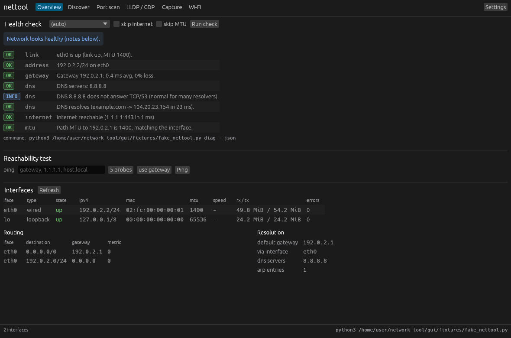
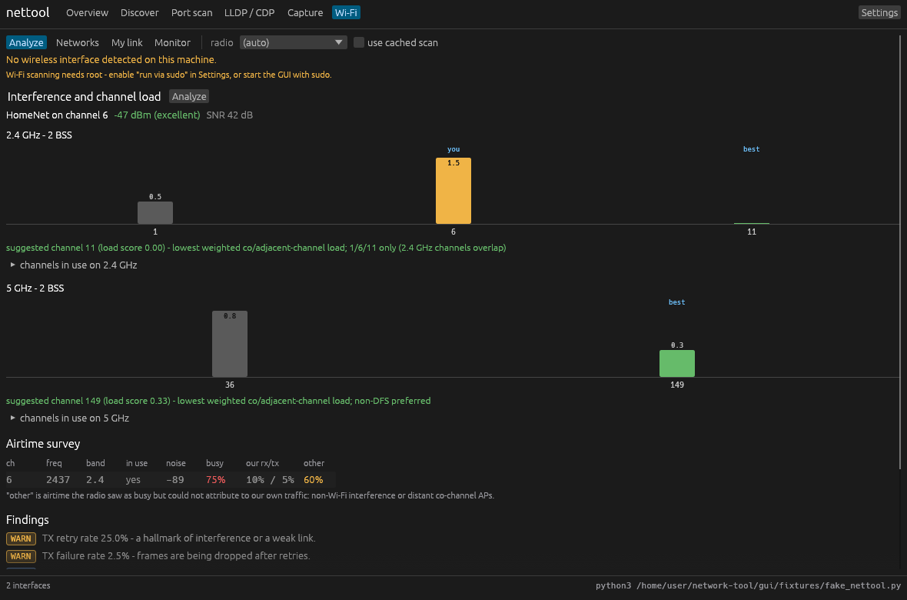
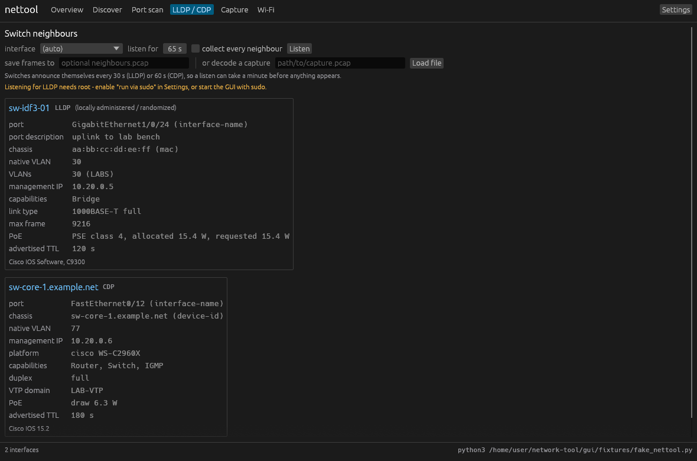
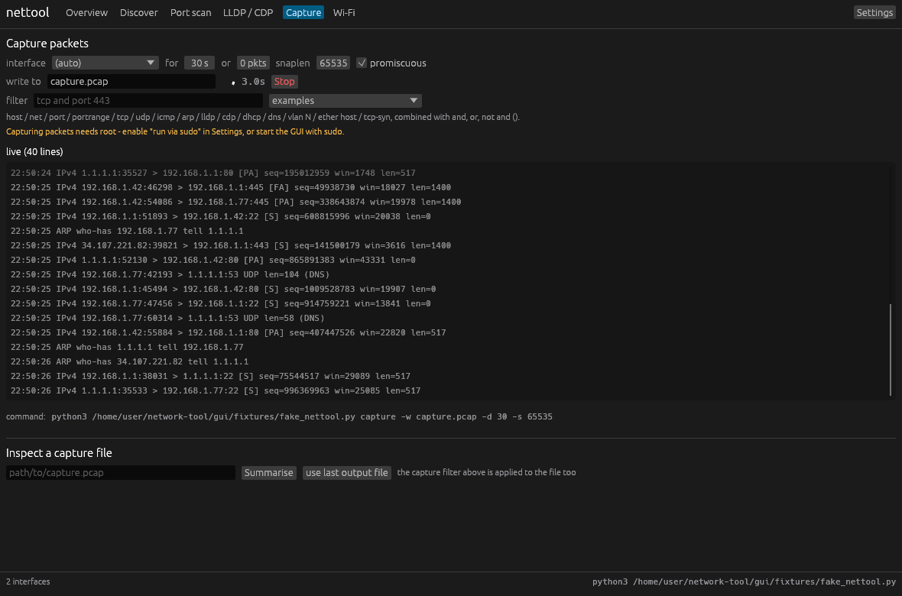

# nettool-gui

A desktop GUI for [nettool](../README.md), written in Rust with
[egui](https://github.com/emilk/egui)/eframe.



The GUI does not re-implement any diagnostics. It runs `nettool ... --json` on worker
threads and renders the results, so the CLI and the GUI can never disagree, and every
view shows the exact command it ran.

## Build and run

```bash
cd gui
cargo run --release            # or: cargo build --release && ./target/release/nettool-gui
```

### A double-clickable macOS app

```bash
./gui/macos/build-app.sh                 # build nettool.app for this Mac
./gui/macos/build-app.sh --universal     # Intel + Apple Silicon in one binary
./gui/macos/build-app.sh --dmg           # also produce nettool.dmg

open gui/target/macos/nettool.app        # run it, or drag it to /Applications
```

The script builds the release binary, assembles `nettool.app`, copies the Python CLI into
`Contents/Resources` (so the app is self-contained), renders the icon into an `.icns` with
`sips`/`iconutil`, and ad-hoc signs the bundle. The first launch of an unsigned app needs
**right-click → Open**; after that it opens normally.

To capture packets without running the whole GUI as root, install the BPF helper once -
the same mechanism Wireshark's ChmodBPF uses:

```bash
sudo ./gui/macos/install-bpf-access.sh   # then log out and back in
sudo ./gui/macos/uninstall-bpf-access.sh # to undo it
```

The icon is generated by `macos/make-icon.py` (pure Python, no dependencies); rerun it if
you want to change the artwork.

It finds nettool automatically: the `nettool` binary on `PATH` first, then
`python3 -m nettool` from the repository checkout. Override it in Settings or on the
command line.

```
nettool-gui [options]
  --tab <name>                  open on overview | discover | scan | lldp | capture | wifi
  --wifi-view <name>            wifi sub-view: analyze | networks | link | monitor
  --nettool <cmd>               how to run nettool, e.g. "python3 -m nettool"
  --sudo                        run nettool through `sudo -n`
  --autorun                     run the opening tab's action immediately
  --screenshot <png>            render, save a PNG and exit (docs / CI)
  --screenshot-delay <seconds>  how long to let results load first
```

Linux needs the usual windowing libraries (`libxkbcommon-x11`, X11 or Wayland, and a GL
driver). It runs headless under `Xvfb` with `LIBGL_ALWAYS_SOFTWARE=1`, which is how the
screenshots in this README are produced. macOS needs nothing beyond the Rust toolchain.

### Privileges

Capture, LLDP listening, ARP sweeps and ICMP need raw packet access: `CAP_NET_RAW` on
Linux, `/dev/bpf*` on macOS. Either start the GUI with sudo, or tick **run via sudo** in
Settings — that prefixes `sudo -n`, which never prompts, so configure a NOPASSWD rule for
nettool if you use it. On macOS the tidier option is `macos/install-bpf-access.sh`, after
which nothing needs sudo. When the GUI is already running as root the sudo hints
disappear on their own.

On macOS the Wi-Fi views depend on what the OS is willing to report: without the Location
Services permission the SSID and BSSID come back redacted, and there is no airtime survey
at all. Signal, SNR, channel load and the channel recommendation work regardless.

## Tabs

| Tab | What it does |
|---|---|
| **Overview** | Runs the full health check (link, addressing, gateway, DNS, internet, MTU, Wi-Fi) with severity badges, plus a ping test and the interface/route/DNS inventory. |
| **Discover** | ARP / ICMP / TCP host sweep with vendor lookup, a live filter box, duplicate-IP warnings, and a *scan ports* button on each host that jumps to the scan tab. |
| **Port scan** | TCP or UDP scanning with port presets, banner grabbing, and results grouped per host with colour-coded states. |
| **LLDP / CDP** | Listens for switch announcements and renders each neighbour as a card: port, native and voice VLAN, PoE budget, management IP, duplex, max frame. Can also decode neighbours out of a saved pcap. |
| **Capture** | Live packet view streaming from the running capture, writing a standard pcap, with the filter language and a Stop button. Below it, summarise any pcap file: protocol mix, top talkers, conversations. |
| **Wi-Fi** | Four views — *Analyze* (per-channel congestion bar charts, recommended channel, airtime survey, findings), *Networks* (scan table with signal bars), *My link* (RSSI, SNR, bitrate, retries), *Monitor* (live signal chart with swing and roaming detection). |







## Design notes

* **Nothing blocks the UI.** Every invocation is a `Job` on its own thread that streams
  stdout back through a channel. Long jobs (a 60 s capture, a `/24` scan) show a live
  timer and a Stop button that kills the child process.
* **The Wi-Fi monitor** is a repeating job: it re-runs `wifi link --json` on an interval
  and plots each sample, so the chart is live rather than a summary printed at the end.
* **Model tolerance.** Every field is optional or defaulted, so a newer or older nettool
  cannot crash a view; unknown fields are ignored.
* **The exact command is always visible** under each panel — the GUI is a front end, not
  a black box.

## Tests

```bash
cargo test          # 31 tests, no window required
cargo clippy --all-targets
```

`tests/model_tests.rs` parses the recorded fixtures in `fixtures/` (captured from the
real tool, including the Python-style integer-keyed maps in the Wi-Fi analysis),
`tests/runner_tests.rs` covers argv construction, sudo prefixing, stdout streaming,
stderr surfacing, cancellation and repeat-mode sampling, and `tests/ui_tests.rs` covers
the rating thresholds, colour mapping and formatting.

`fixtures/fake_nettool.py` replays those fixtures as if it were the CLI, which is how the
Wi-Fi views are exercised on machines with no radio:

```bash
cargo run -- --nettool "python3 fixtures/fake_nettool.py" --tab wifi --autorun
```
